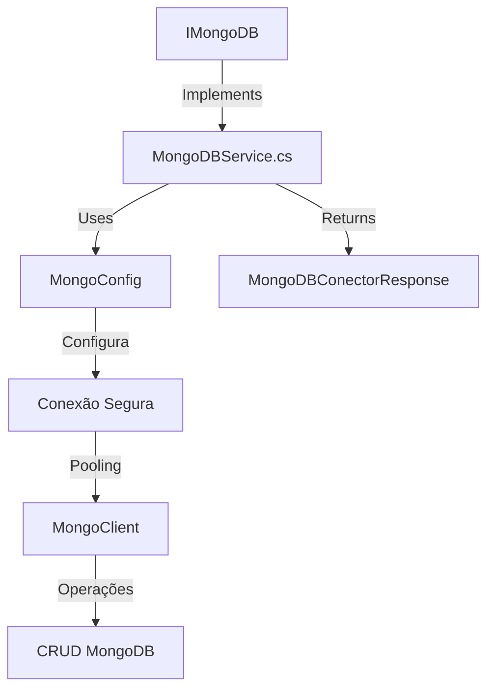

# AI Guide for High Performance MongoDB Integration

## Repository Overview



## Core Structures

```csharp
// MongoConfig (actual implementation)
public class MongoConfig {
    public string ConnectionString { get; set; }
    public string DatabaseName { get; set; }
    public string CollectionName { get; set; }
    public int? MaxPoolSize { get; set; }
    public bool? UseSSL { get; set; }
}

// MongoDBConectorResponse (actual response format)
public class MongoDBConectorResponse {
    public bool Success { get; set; }
    public string Message { get; set; }
    public string Data { get; set; }
}
```

## Prompt Engineering Templates

### 1. Contextual Code Generation

```plaintext
"Create a paginated query method that:
1. Uses MongoConfig for configuration
2. Implements skip/limit according to Demo_MongoDB_Conector
3. Returns MongoDBConectorResponse with TotalCount
4. Includes standard error handling from the repository"
```

### 2. Performance Analysis

```plaintext
"Optimize connection in method X considering:
- Connection pool size (MaxPoolSize)
- Connection timeout
- TLS/SSL usage
```


## Proven Patterns (From MongoDBService.cs)

### Optimized Connection

```csharp
public IMongoDatabase GetDatabase(MongoConfig config) {
    var settings = MongoClientSettings.FromConnectionString(config.ConnectionString);
    settings.MaxConnectionPoolSize = config.MaxPoolSize ?? 100;
    settings.SocketTimeout = TimeSpan.FromSeconds(30);
    settings.ConnectTimeout = TimeSpan.FromSeconds(15);
    settings.UseTls = config.UseSSL ?? true;
    return new MongoClient(settings).GetDatabase(config.DatabaseName);
}
```

### Standard Error Handling

```csharp
try {
    var database = GetDatabase(config);
    var collection = database.GetCollection<BsonDocument>(config.CollectionName);
    // Operação MongoDB
    return new MongoDBConectorResponse { Success = true, Data = result };
}
catch (MongoException ex) {
    return new MongoDBConectorResponse {
        Success = false,
        Message = $"MongoDB failure: {ex.Message}",
        Data = ex.ErrorLabels,
        StatusCode = 500
    };
}
```

## AI Implementation Checklist

1. ✅ Use IMongoDB interfaces
2. ✅ Validate MongoConfig before use
3. ✅ Follow MongoDBConectorResponse pattern
4. ✅ Implement connection pooling
5. ✅ Enable TLS/SSL by default
6. ✅ Log errors with ErrorLabels
7. ✅ Use synchronous methods
8. ✅ Maintain stateless functions
