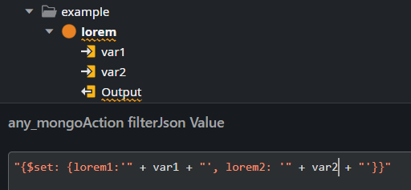
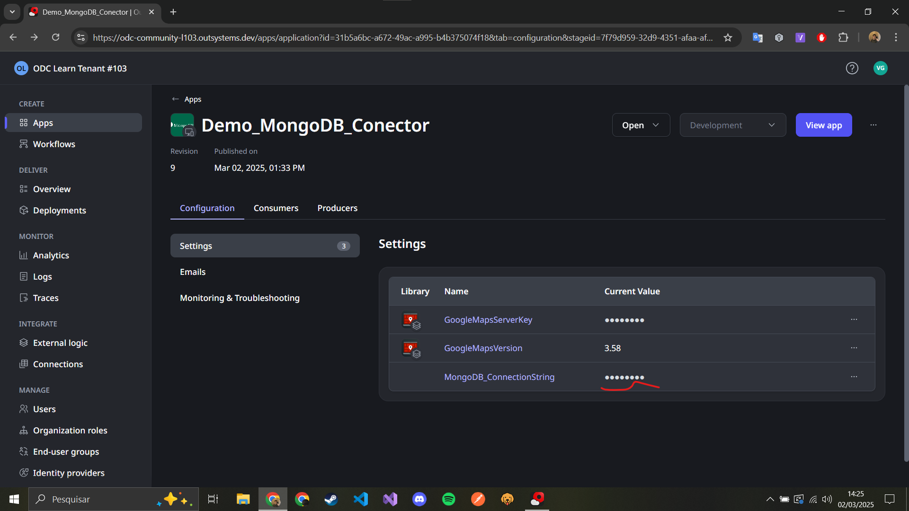

# MongoDB OutSystems Connector (ODC)

[](https://dotnet.microsoft.com)
[](https://www.mongodb.com)
[](https://www.nuget.org/packages/MongoDB.Driver/3.2.1)
[](https://www.outsystems.com/low-code-platform/developer-cloud/)
[](https://www.nuget.org/packages/OutSystems.ExternalLibraries.SDK/1.5.0)


A production-ready integration layer enabling OutSystems applications to interact with MongoDB using .NET 8. Implements stateless operations following OutSystems ODC best practices.

## Key Features

- 🚀 **Full CRUD Operations** with JSON input/output
- 📊 **Aggregation Pipeline** support with explain plans
- ⚡ **Connection Pooling** with TLS/SSL configuration
- 📑 **Pagination** & Document Counting
- 🔍 **Collection Statistics** & Index Management
- 🛡️ **Enterprise-Grade Security** with configurable TLS

## Implementation Overview

```tree
MongoDB_ODC/
├── IMongoDB.cs            # Interface with ODC attributes
├── MongoDBService.cs      # Core MongoDB operations
├── Structures/
│   ├── MongoConfig.cs     # Connection config: { ConnectionString, DatabaseName, CollectionName }
│   └── MongoDBResponse.cs # Standard response { Success, Message, Data }
└── Helpers/
    ├── JsonHelper.cs      # BSON/JSON conversions
    └── QueryBuilder.cs    # Filter/Pipeline validation
```

## Core Operations Example

>[!IMPORTANT]
All functions must be stateless and receive their entire necessary context via input parameters.
>



## Critical Implementation Details

### Connection Management

#### OutSystems ODC Consumer Configuration

In your OutSystems application, go to Portal > apps > you aplication> Configuration



```csharp
private IMongoDatabase GetDatabase(MongoConfig config)
{
    var settings = MongoClientSettings.FromConnectionString(config.ConnectionString);
    settings.MaxConnectionPoolSize = config.MaxPoolSize ?? 2;
    settings.UseTls = config.UseSSL ?? true;
    
    return new MongoClient(settings).GetDatabase(config.DatabaseName);
}
```

- **Pooling**: Default 2 connections (configurable via `MaxPoolSize`)
- **Security**: TLS enabled by default
- **Stateless**: New client per request (ODC compliant)

### Error Handling Pattern

```csharp
try {
    // MongoDB operation
    return new MongoDBResponse { Success = true, Data = results };
}
catch (MongoException ex) {
    return new MongoDBResponse {
        Success = false,
        Message = $"DB Error: {ex.Message}",
        Data = ex.ErrorLabels
    };
}
```

## Performance Considerations

1. **Indexing**: Use `GetIndexInfo()` to verify query coverage
2. **Projection**: Filter document fields in aggregation pipelines
3. **Batching**: Use `GetPagedDocuments(skip, limit)` for large datasets
4. **Monitoring**: Check `GetCollectionStats()` for storage metrics

## Recommended Resources

- [MongoDB .NET Driver Docs](https://mongodb.github.io/mongo-csharp-driver/)
- [ODC External Libraries Guide](https://success.outsystems.com/documentation/outsystems_developer_cloud/building_apps/extend_your_apps_with_custom_code/external_libraries_sdk_readme/)
- [MongoDB Performance Tuning](https://www.mongodb.com/docs/manual/core/performance-best-practices/)

---

🔧 **Maintained by**: [Victor Resende](https://linkedin.com/in/victorvrg)  
📦 **NuGet**: `Install-Package MongoDB.ODC.Integration`  
🐛 **Issue Tracking**: GitHub Issues
