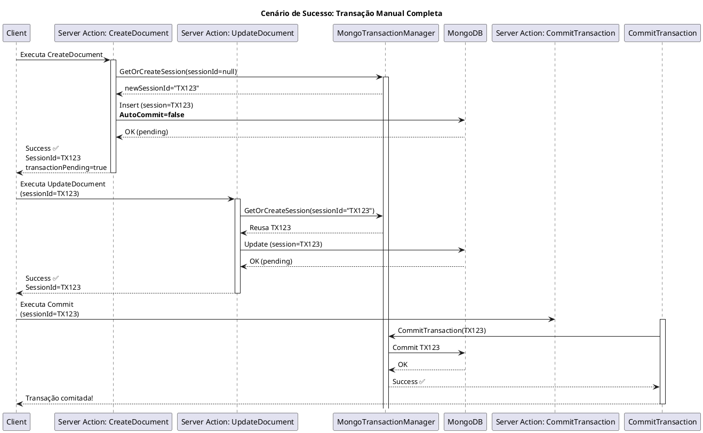
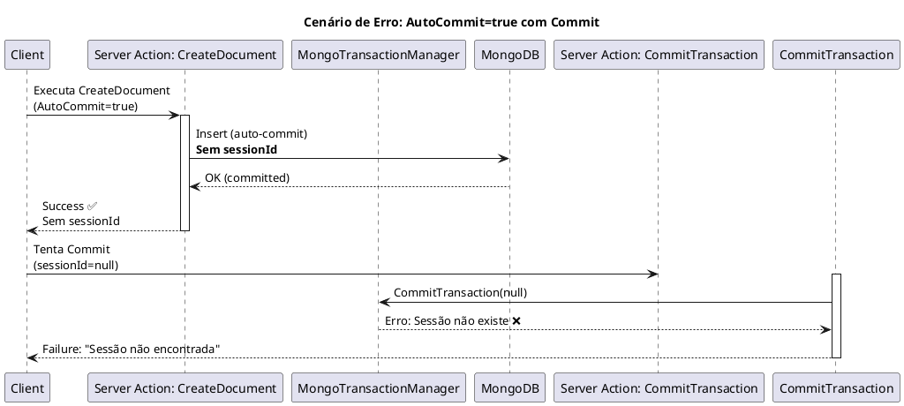
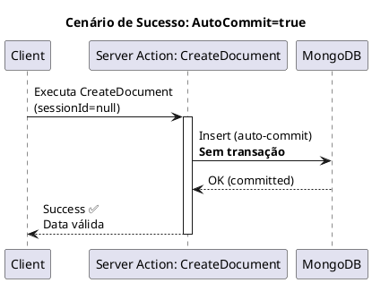
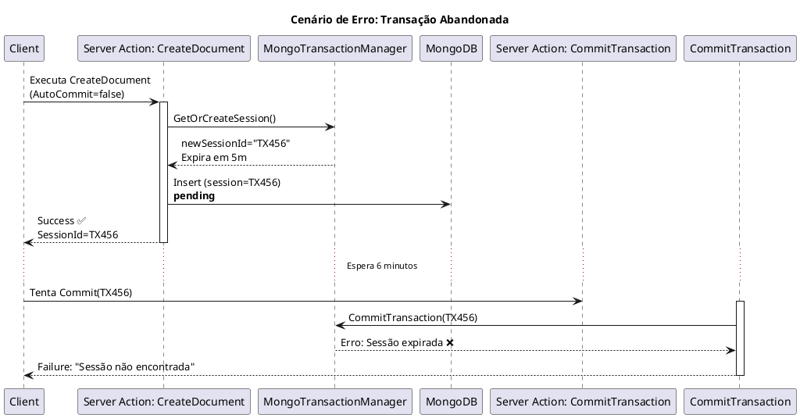

# Roadmap de Uso do Conector MongoDB

---

### **1. Cenário de Sucesso: Transação Manual Completa (AutoCommit=false)**

---

### **2. Cenário de Erro: AutoCommit Ativo com Tentativa de Commit Manual**

---

### **3. Cenário de Sucesso: AutoCommit=true (Comportamento Default)**

---

### **4. Cenário de Erro: Transação Abandonada (Timeout)**

---
